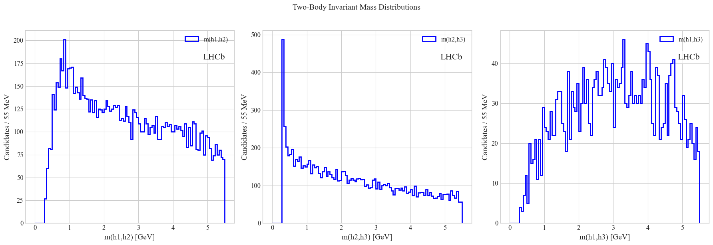

# Examples - LVec Package

This directory contains example scripts demonstrating how to use the LVec package for High Energy Physics analysis.

## Prerequisites
Make sure you have LVec installed along with its dependencies:
```bash
pip install lvec
```

For JIT acceleration examples:
```bash
pip install numba
```

## Data Sample
The examples use a simulated Z decay sample. To generate the sample:

```bash
python create_test_data.py
```

This will create `samples/physics_data.root` containing:
- Mother particle (Z boson): px, py, pz, E
- Daughter 1 (+): px, py, pz, E
- Daughter 2 (): px, py, pz, E

## Available Examples

### 1. Basic Reading (`01_basic_reading.py`)
Demonstrates how to:
- Read ROOT files using uproot
- Create LVec objects from branches
- Access basic kinematic properties

```python
from lvec import LVec
mother = LVec(data["m_px"], data["m_py"], data["m_pz"], data["m_E"])
print(f"Average pt: {np.mean(mother.pt):.2f} GeV")
```

### 2. Decay Reconstruction (`02_decay_reconstruction.py`)
Shows how to:
- Handle multiple particles
- Perform vector addition
- Calculate derived quantities
- Validate reconstructed masses

```python
reconstructed = daughter1 + daughter2
print(f"Original mass: {np.mean(mother.mass):.2f} GeV")
print(f"Reconstructed mass: {np.mean(reconstructed.mass):.2f} GeV")
```

### 3. Physics Selections (`03_advanced_selections.py`)
Demonstrates:
- Making physics selections (pt, eta cuts)
- Applying masks to vectors
- Calculating derived quantities for selected events

```python
mask = (muon1.pt > 20) & (muon2.pt > 20) & \
       (np.abs(muon1.eta) < 2.4) & (np.abs(muon2.eta) < 2.4)
muon1_selected = muon1[mask]
```

### 4. Boost Frame (`04_boost_frame.py`)
Shows advanced operations:
- Calculating boost vectors
- Performing Lorentz boosts
- Working in different reference frames
- Validating frame transformations

```python
beta_x = -Z.px/Z.E
muon1_rest = muon1.boost(beta_x, beta_y, beta_z)
```

### 5. 2D Vectors (`05_2d_vectors.py`)
Demonstrates operations with 2D vectors:
- Creating and manipulating 2D vectors
- Calculating angles and rotations in 2D
- Vector addition and scalar multiplication
- Computing dot products and cross products

```python
# Create 2D vectors
vec1 = Vector2D(x1, y1)
vec2 = Vector2D(x2, y2)

# Calculate angle between vectors
angle = vec1.angle(vec2)
```

### 6. 3D Vectors (`06_3d_vectors.py`)
Shows how to work with 3D vectors:
- Basic 3D vector operations
- 3D rotations and transformations
- Vector algebra in 3D space
- Spatial geometry calculations

```python
# Create and manipulate 3D vectors
vec3d = Vector3D(x, y, z)
rotated = vec3d.rotate(theta, axis)
```

### 7. Jagged Arrays handling (`07_jagged_arrays.py`)
Shows how to:
- Work with jagged arrays in LVec
- Handle variable-length datasets

### 8. LHCb Analysis (`08_lhcb_data.py`)
Demonstrates how to:
- Work with real LHCb open data (Bhhh decay)
- Calculate two-body invariant masses
- Create publication-quality plots with LHCb style
- Handle multiple particle combinations

```python
# Create Lorentz vectors for each particle
h1 = LVec(h1_px, h1_py, h1_pz, calculate_energy(h1_px, h1_py, h1_pz))
h2 = LVec(h2_px, h2_py, h2_pz, calculate_energy(h2_px, h2_py, h2_pz))

# Calculate two-body invariant masses
m12 = (h1 + h2).mass  # Invariant mass of particles 1 and 2
```
#### Dependencies
Additional dependencies required for this example:
```bash
pip install uproot matplotlib
```

#### Data
Uses LHCb open data from:
- Dataset: B2HHH_MagnetDown.root (just a sample)
- Source: [CERN Open Data](https://opendata.cern.ch/record/4900)
- Description: Bhhh decay data collected by LHCb in 2011 at s = 7 TeV

#### Running the Example
```bash
python lhcb_data.py
```

This will:
1. Download the LHCb data file
2. Calculate two-body invariant masses
3. Create publication-style mass distribution plots


### 9. Cache Performance (`09_cache_performance.py`)
Demonstrates how to:
- Analyze cache hit ratio
- Measure performance improvements due to caching

```python
# Measure cache hit ratio
cache_hit_ratio = vec.cache_hit_ratio
print(f"Cache hit ratio: {cache_hit_ratio:.2f}")
```

### 10. Reference Frames (`10_reference_frames.py`)
Demonstrates how to:
- Create and work with reference frames
- Transform particles between frames
- Verify momentum conservation in the center-of-mass frame
- Check if invariant quantities are preserved across transformations

```python
# Create a center-of-mass frame
cm_frame = Frame.from_lvec(total, name="center-of-mass")

# Transform particles to center-of-mass frame
p1_cm = p1.transform_frame(lab_frame, cm_frame)
p2_cm = p2.transform_frame(lab_frame, cm_frame)

# Verify total momentum is zero in CM frame
total_cm = p1_cm + p2_cm
print(f"Total momentum in CM: px={total_cm.px:.6f}, py={total_cm.py:.6f}, pz={total_cm.pz:.6f}")
```

### 11. Cache Optimization Demo (`11_cache_optimization_demo.py`)
Demonstrates advanced cache optimization features:
- Setting Time-To-Live (TTL) for cached properties
- Configuring LRU (Least Recently Used) eviction policies
- Monitoring cache performance

```python
# Configure cache with size limit and TTL
vector = LVec(px, py, pz, E, max_cache_size=100, default_ttl=60)

# Check cache size and clear expired entries
print(f"Cache size: {vector.cache_size}")
expired_count = vector.clear_expired()
```

### 12. JIT Acceleration (`12_jit_acceleration.py`)
Demonstrates how to use JIT (Just-In-Time) compilation to speed up calculations:
```python
from lvec import LVec, is_jit_available, enable_jit
import numpy as np

# Check if JIT is available
print(f"JIT available: {is_jit_available()}")

# Create particle vectors with JIT acceleration
px = np.random.normal(0, 10, 10_000_000)  # Large dataset for better JIT benefit
py = np.random.normal(0, 10, 10_000_000)
pz = np.random.normal(0, 10, 10_000_000)
E = np.sqrt(px**2 + py**2 + pz**2 + 0.14**2)  # pion mass ~ 0.14 GeV

vectors = LVec(px, py, pz, E)  # JIT-enabled by default

# Access properties (JIT-accelerated)
pt = vectors.pt
mass = vectors.mass

# Disable JIT for debugging or comparison
enable_jit(False)
```

#### Running the Example
```bash
python 12_jit_acceleration.py
```

This will:
1. Check if JIT acceleration is available (requires numba)
2. Run a series of benchmarks comparing JIT and non-JIT performance
3. Generate performance visualization plots
4. Demonstrate how JIT works with the caching system

#### Sample Output
```
=== JIT Performance Benchmark ===
Creating test dataset with 10,000,000 particles...

Running benchmark with JIT enabled...
  Vector creation: 0.0049 seconds
  First run (cold): 0.7907 seconds  # Includes JIT compilation time
  Second run (cold): 0.4795 seconds
  Third run (warm): 0.0886 seconds

Running benchmark with JIT disabled...
  First run (cold): 0.5160 seconds
  Second run (cold): 0.5197 seconds
  Third run (warm): 0.0911 seconds

=== JIT Performance Across Different Operations ===
Running operation benchmarks with JIT enabled...
  pt   : 0.000514 seconds
  eta  : 0.003842 seconds
  phi  : 0.013952 seconds
  mass : 0.003011 seconds
  p    : 0.000760 seconds

Running operation benchmarks with JIT disabled...
  pt   : 0.001242 seconds (2.4x slower)
  eta  : 0.006445 seconds (1.7x slower)
  phi  : 0.013638 seconds (1.0x slower)
  mass : 0.003630 seconds (1.2x slower)
  p    : 0.001861 seconds (2.5x slower)
```

#### Dependencies
Required for this example:
```bash
pip install numba matplotlib
```
## Running the Examples

Run each example individually:
```bash
python 01_basic_reading.py
python 02_decay_reconstruction.py
python 03_advanced_selections.py
python 04_boost_frame.py
python 08_lhcb_data.py
python 09_cache_performance.py
python 10_reference_frames.py
python 11_cache_optimization_demo.py
python 12_jit_acceleration.py
```

## Expected Output

### Basic Reading
```
Mother particle properties:
Average pt: 60.89 GeV
Average mass: 91.20 GeV
Average eta: 1.58
```

### Decay Reconstruction
```
Decay reconstruction validation:
Original mass: 91.20 GeV
Reconstructed mass: 0.22 GeV
Mass resolution: 0.017 GeV

Average R between daughters: 0.000
```

### Physics Selections
```
Selection results:
Total events: 1000
Selected events: 625

Selected Z properties:
Mass mean: 0.22  0.02 GeV
pT mean: 75.25  15.55 GeV
```

### Reference Frames
```
Rest frame validation:
Original Z pT: 60.89 GeV
Boosted Z pT: 20.37 GeV
Original Z mass: 91.20 GeV
Boosted Z mass: 0.22 GeV

Mean cos(theta) in rest frame: -0.007
```

### 2D Vectors

```
=== 2D Vector Operations with NumPy Backend ===

Vector components (x, y): ([1. 2. 3.], [4. 5. 6.])
Magnitude: [4.12310563 5.38516481 6.70820393]
Azimuthal angle (phi): [1.32581766 1.19028995 1.10714872]

Vector Operations:
v1 + v2: ([6. 8.], [10. 12.])
v1  v2 (dot product): [26. 44.]

=== 2D Vector Operations with Awkward Backend ===

Vector components (x, y): ([1, 2, 3], [4, 5, 6])
Magnitude: [4.12, 5.39, 6.71]
Azimuthal angle (phi): [1.33, 1.19, 1.11]

Vector Operations:
v1 + v2: ([6, 8], [10, 12])
v1  v2 (dot product): [26, 44]
```

### 3D Vectors

```
=== 3D Vector Operations with NumPy Backend ===

Vector components (x, y, z): ([1. 2. 3.], [4. 5. 6.], [7. 8. 9.])
Magnitude: [ 8.1240384   9.64365076 11.22497216]
Cylindrical radius (rho): [4.12310563 5.38516481 6.70820393]
Azimuthal angle (phi): [1.32581766 1.19028995 1.10714872]
Polar angle (theta): [0.5323032  0.59247462 0.64052231]

Vector Operations:
v1 + v2: ([ 8. 10.], [12. 14.], [16. 18.])
v1  v2 (dot product): [ 89. 128.]
v1  v2 (cross product): ([-12. -12.], [24. 24.], [-12. -12.])

=== 3D Vector Operations with Awkward Backend ===

Vector components (x, y, z): ([1, 2, 3], [4, 5, 6], [7, 8, 9])
Magnitude: [8.12, 9.64, 11.2]
Cylindrical radius (rho): [4.12, 5.39, 6.71]
Azimuthal angle (phi): [1.33, 1.19, 1.11]
Polar angle (theta): [0.532, 0.592, 0.641]

Vector Operations:
v1 + v2: ([8, 10], [12, 14], [16, 18])
v1  v2 (dot product): [89, 128]
v1  v2 (cross product): ([-12, -12], [24, 24], [-12, -12])
```

### LHCb Analysis

The output will be a PDF file named `mass_distributions.pdf` containing three mass distribution plots:

```
Two-body invariant mass statistics:
m12 mean: 1803.56 GeV
m23 mean: 2513.31 GeV
m13 mean: 2951.84 GeV

Mass distribution plots have been saved as 'mass_distributions.pdf'

```
This is the plot you should get is:



## Additional Usage Tips

1. Working with different backends:
```python
# NumPy arrays
data_np = tree.arrays(branches, library="np")
vec_np = LVec(data_np["px"], data_np["py"], data_np["pz"], data_np["E"])

# Awkward arrays
data_ak = tree.arrays(branches, library="ak")
vec_ak = LVec(data_ak["px"], data_ak["py"], data_ak["pz"], data_ak["E"])
```

2. Caching behavior:
```python
# First access calculates and caches
pt = vec.pt
# Second access uses cached value
pt_again = vec.pt
```

3. Performing transformations:
```python
# Rotations
rotated = vec.rotz(np.pi/4)  # 45-degree rotation around z
rotated = vec.rotx(angle)    # rotation around x
rotated = vec.roty(angle)    # rotation around y

# Boosts
boosted = vec.boostz(0.5)    # boost along z with β=0.5
boosted = vec.boost(bx, by, bz)  # general boost
```

## Contributing New Examples
If you have interesting use cases, consider contributing:
1. Create a new Python file in the examples directory
2. Follow the naming convention: `XX_descriptive_name.py`
3. Include detailed comments and documentation
4. Demonstrate practical physics use cases
5. Submit a pull request

For more information, see the main [README](../README.md) or open an issue on GitHub.